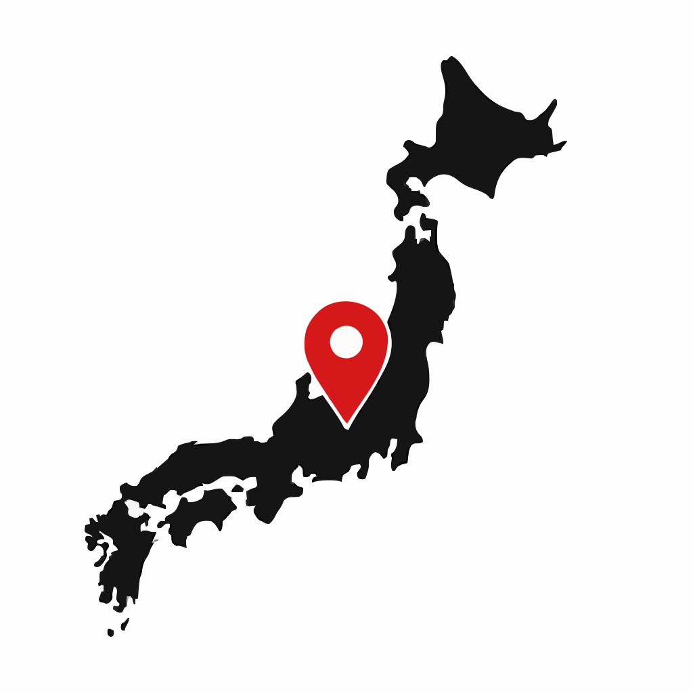
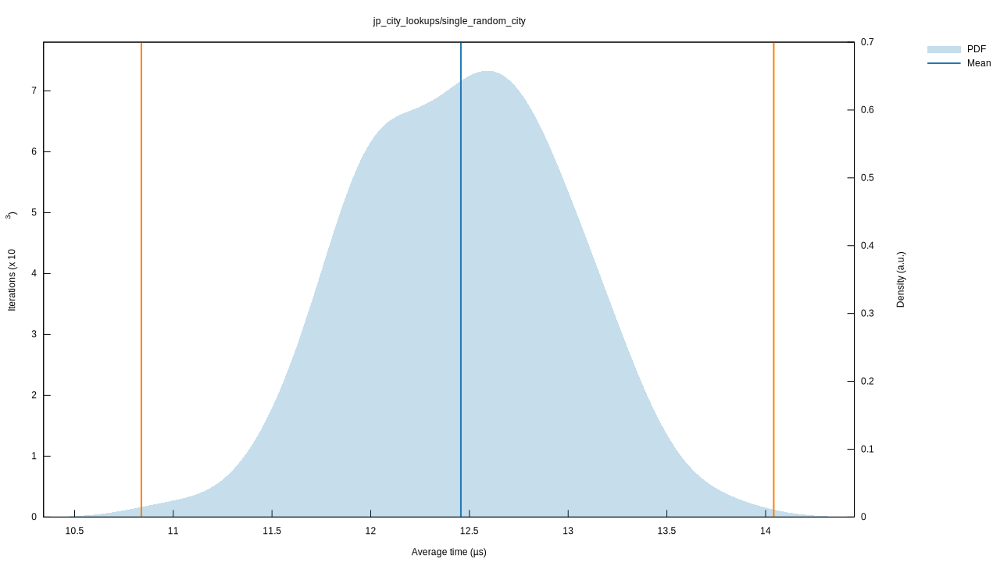

# Japan Geo Reverse Lookup

A Rust library for reverse geocoding in Japan. Given a longitude and latitude,
this library returns information about the region(s) the coordinates are located
in, including code, name, and English name.

## Installation

### Rust [](https://crates.io/crates/reversejp)
[](https://app.fossa.com/projects/git%2Bgithub.com%2Fringsaturn%2Freversejp?ref=badge_shield)

```bash
cargo add reversejp
```

```rust
// reversejp-rust/examples/demo.rs
use reversejp::ReverseJp;

let reverse_jp = ReverseJp::with_embedded_data().unwrap();
let props = reverse_jp.find_properties(139.7670, 35.6812);

for prop in props {
    println!("Code: {}, Name: {}, English Name: {}", prop.code, prop.name, prop.en_name);
}
```

Example output:

```text
Code: 130010, Name: 東京都, English Name: Tokyo
Code: 1310100, Name: 千代田区, English Name: Chiyoda City
```

Performance benchmark(Under MacBook Pro with Apple M3 Max):



### Python [](https://pypi.org/project/reversejp/)

```bash
pip install reversejp
```

```py
# reversejp-python/examples/demo.py
import reversejp

props = reversejp.find_properties(139.7670, 35.6812)

for prop in props:
    print(prop.code, prop.name, prop.en_name)
```

Example output:

```text
130010 東京都 Tokyo
1310100 千代田区 Chiyoda City
```

Performance benchmark(Under MacBook Pro with Apple M3 Max):

```text
-------------------------------------------------- benchmark: 1 tests --------------------------------------------------
Name (time in us)           Min       Max     Mean   StdDev   Median     IQR  Outliers  OPS (Kops/s)  Rounds  Iterations
------------------------------------------------------------------------------------------------------------------------
test_city_benchmark     11.2909  623.2501  13.9494  20.8232  12.5421  0.5411   91;3468       71.6877   21090           1
------------------------------------------------------------------------------------------------------------------------
```

### JavaScript&TypeScript via WebAssembly [](https://www.npmjs.com/package/reversejp-wasm)

```bash
# Install via bun or any other package manager
bun add reversejp-wasm
```

The command above produces a `pkg/` directory containing the WebAssembly module
and TypeScript bindings that can be published to npm or consumed directly.

```js
// reversejp-wasm/example/index.ts
import init, { initialize, find_properties } from "../pkg/reversejp_wasm.js";

await init();
initialize();

// `find_properties` returns an array of objects with the same shape as the
// `Properties` struct in the Rust crate: `{ code, name, enName }`.
const results = find_properties(139.767, 35.6812);
console.log(JSON.stringify(results, null, 2));
```

Run via

```bash
bun run reversejp-wasm/example/index.ts
```

Output:

```console
[
  {
    "code": "130010",
    "name": "東京都",
    "enName": "Tokyo"
  },
  {
    "code": "1310100",
    "name": "千代田区",
    "enName": "Chiyoda City"
  }
]
```

For basic JavaScript usage, see
[`reversejp-wasm/preview/index.html`](reversejp-wasm/preview/index.html) which
online previewed at
[https://ringsaturn.github.io/reversejp/](https://ringsaturn.github.io/reversejp/).

## License

MIT

Data is sourced from the Japan Meteorological Agency website.


[](https://app.fossa.com/projects/git%2Bgithub.com%2Fringsaturn%2Freversejp?ref=badge_large)